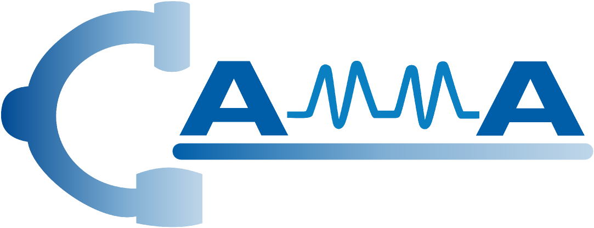

<div align="center">
<a href="http://camma.u-strasbg.fr/">

</a>
</div>

# **Surg-FTDA: Few-shot Text-driven Adaptation of Foundation Models for Surgical Workflow Analysis**

_Tingxuan Chen, Kun Yuan, Vinkle Srivastav, Nassir Navab, Nicolas Padoy_

[](https://arxiv.org/abs/2501.09555) 

Surg-FTDA (Few-shot Text-driven Adaptation) is a novel approach designed to adapt multimodal foundation models to surgical workflow analysis tasks. By leveraging a two-stage process, Surg-FTDA effectively minimizes the reliance on large-scale annotated datasets and bridges the modality gap between image and text embeddings.

### Key Features:

1. **Few-shot Data Anchor Selection**: Reduces the need for extensive paired datasets by selecting a small subset of diverse and representative image-text pairs.
2. **Modality Alignment**: Aligns image embeddings with text embeddings using an MLP to transform them into a shared semantic space.
3. **Text-driven Adaptation**: A text-only training method to train a decoder, enabling the model to generalize across generative tasks like captioning and discriminative tasks such as phase and triplet recognition.

Surg-FTDA has been validated on two foundation models, CLIP and SurgVLP, demonstrating its flexibility and robustness in surgical workflow analysis. Surg-FTDA supports generation tasks(image caption) and discrimination tasks(triplet recognition, phase recognition). 


## File Structure

- **`Caption/`**: Contains code for generative tasks, such as generating captions for surgical images.
- **`Discrimination/`**: Contains code for discriminative tasks, including triplet recognition and phase recognition.

## Installation

To set up the environment for Surg-FTDA, install the dependencies using the provided `environment.yaml` file:

```bash
conda env create -f environment.yaml
conda activate surg-ftda
```

## Usage

### Prerequisites: Adjust File Paths

Before running the code, ensure you adjust the paths for the following files in the relevant configuration files:

1. **Processed JSON Files**: Our processed JSON files, containing image paths and corresponding annotations, are stored at the following link:  
   [Google Drive - Processed JSON Files](https://drive.google.com/drive/folders/1NrNtcvUvMUJz23VXeyIpLMCGuux_VUgg?dmr=1&ec=wgc-drive-globalnav-goto).  

2. **Cholec80 Dataset**: The Cholec80 dataset must be downloaded separately. Use the `data_process.py` script to convert the relative paths in the JSON files to absolute paths before running further tasks.

3. **PKL Files**: Include pre-generated embeddings for text and image encoders.

4. **PT Files**: Provide paths to the pre-trained model weights (e.g. SurgVLP).

### Caption Tasks

### Step 1: Generate Embedding Spaces

Generate embeddings using CLIP or SurgVLP models:

- **CLIP Embeddings:**
    
    ```bash
    python Caption/embedding_generator_clip.py
    ```
    
- **SurgVLP Embeddings:**
    
    ```bash
    python Caption/embedding_generator_surgvlp.py
    ```
    

### Step 2: Train the Model

Train the model using either text embeddings or image embeddings:

- **Training with CLIP:**
    
    ```bash
    python Caption/train_clip.py
    ```
    
- **Training with SurgVLP:**
    
    ```bash
    python Caption/train_surgvlp.py
    ```
    

### Step 3: Perform Modality Alignment

Use `modality_alignment.py` to align image embeddings to the text embedding space:

```bash
python Caption/modality_alignment.py --config Caption/config_alignment.yaml
```

### Step 4: Generate Captions

Use the prediction scripts to generate captions:

- **Predict with CLIP:**
    
    ```bash
    python Caption/predict_clip.py
    ```
    
- **Predict with SurgVLP:**
    
    ```bash
    python Caption/predict_surgvlp.py
    ```
    

### Step 5: Evaluate Captions

Evaluate the quality of the generated captions:

```bash
python Caption/evaluate_caption.py
```

### Discrimination Tasks

Discrimination tasks involve recognizing triplets and surgical phases. The pipeline supports training models individually for triplet text, phase text, or a unified dataset that combines both types of text, enabling the creation of a single model capable of handling multiple tasks.

### Step 1: Generate Embedding Spaces

Generate embeddings using CLIP or SurgVLP models for triplet tasks, phase tasks, or a combination of both:

- **CLIP Embeddings:**
    
    ```bash
    python Discrimination/embedding_generator_clip.py
    ```
    
- **SurgVLP Embeddings:**
    
    ```bash
    python Discrimination/embedding_generator_surgvlp.py
    ```
    

### Step 2: Train the Model

Train the model using embeddings generated for triplet, phase, or combined datasets. The training process allows the model to learn task-specific or shared representations based on the input text type.

- **Training with CLIP:**
    
    ```bash
    python Discrimination/train_clip.py
    ```
    
- **Training with SurgVLP:**
    
    ```bash
    python Discrimination/train_surgvlp.py
    ```
    

### Step 3: Perform Modality Alignment

Use `modality_alignment.py` to align image embeddings to the text embedding space for triplet text, phase text. 

```bash
python Discrimination/modality_alignment.py 
```

### Step 4: Prediction

Use the prediction scripts to generate outputs for triplet or phase recognition tasks:

- **Predict with CLIP:**
    
    ```bash
    python Discrimination/predict_clip.py
    ```
    
- **Predict with SurgVLP:**
    
    ```bash
    python Discrimination/predict_surgvlp.p
    ```
    

### Step 5: Evaluate Discrimination Tasks

Evaluate the model’s performance on triplet or phase recognition tasks:

- **Evaluate triplet recognition:**
    
    ```bash
    python Discrimination/evaluate/evaluate_triplet.py
    ```
    
- **Evaluate phase recognition:**
    
    ```bash
    python Discrimination/evaluate/evaluate_phase.py
    ```


## References
[Text-driven Adaptation of Foundation Models for Few-shot Surgical Workflow Analysis](https://arxiv.org/abs/2501.09555)          
Bibtex:
```bibtex
@misc{chen2025textdrivenadaptationfoundationmodels,
      title={Text-driven Adaptation of Foundation Models for Few-shot Surgical Workflow Analysis}, 
      author={Tingxuan Chen and Kun Yuan and Vinkle Srivastav and Nassir Navab and Nicolas Padoy},
      year={2025},
      eprint={2501.09555},
      archivePrefix={arXiv},
      primaryClass={cs.CV},
      url={https://arxiv.org/abs/2501.09555}, 
}
```

## License
The code and the models are available for non-commercial scientific research purposes as defined in the [CC BY-NC-SA 4.0](https://creativecommons.org/licenses/by-nc-sa/4.0/). By downloading and using this code you agree to the terms in the [LICENSE](LICENSE). Third-party codes are subject to their respective licenses.

By downloading and using this repo, you agree to these terms and conditions.

## Acknowledgement
This repository is based on [SurgVLP](https://github.com/CAMMA-public/SurgVLP), [CLIP](https://github.com/openai/CLIP), and [CapDec](https://github.com/DavidHuji/CapDec) repositories.

This work has received funding from the European Union
(ERC, CompSURG, 101088553). Views and opinions expressed are however those of the authors only and do not
necessarily reflect those of the European Union or the European Research Council. Neither the European Union nor
the granting authority can be held responsible for them. This work was also partially supported by French state funds
managed by the ANR under Grants ANR-20-CHIA-0029-01 and ANR-10-IAHU-02.
